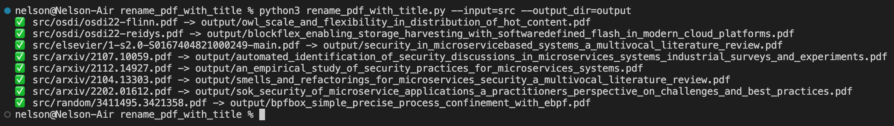
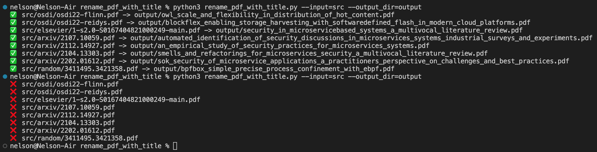
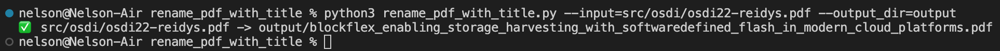

# 使用PDF的标题来自动对PDF文件命名

## 环境配置
```shell
pip3 install pypdf2 pdfminer
```

## Quick Start
把`src`文件夹下的所有pdf文件命名，结果输出到`output`文件夹下。
```shell
python3 rename_pdf_with_title.py --input=src --output_dir=output
```
结果如下


为了防止已有的PDF被覆盖，如果PDF重名，则不会输出。在执行了上述命令后，如果再执行一次，则会出现如下结果。


也可以重命名单个文件。
```shell
python3 rename_pdf_with_title.py --input=src/osdi/osdi22-reidys.pdf --output_dir=output
```
结果如下

